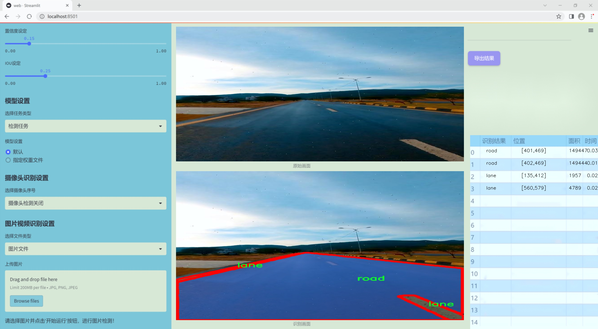
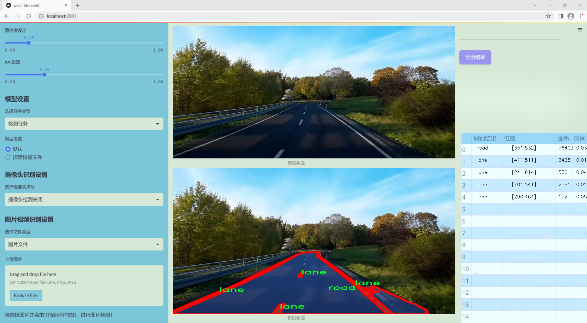
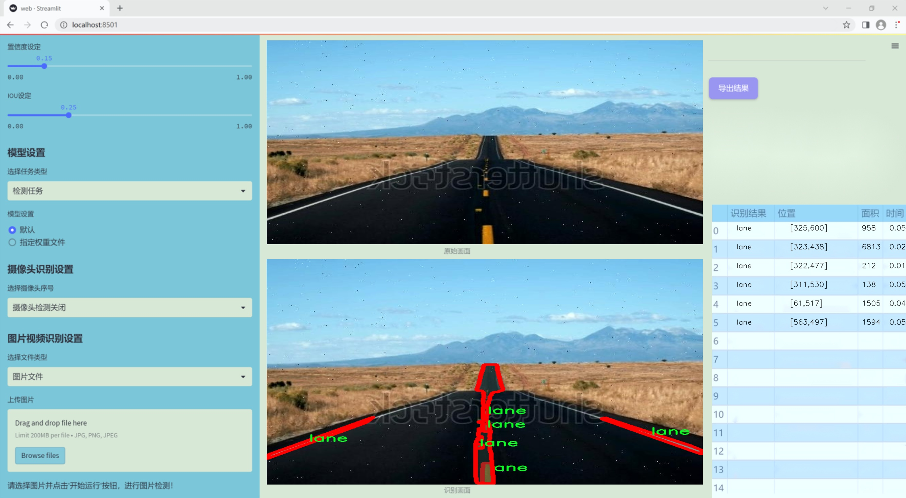
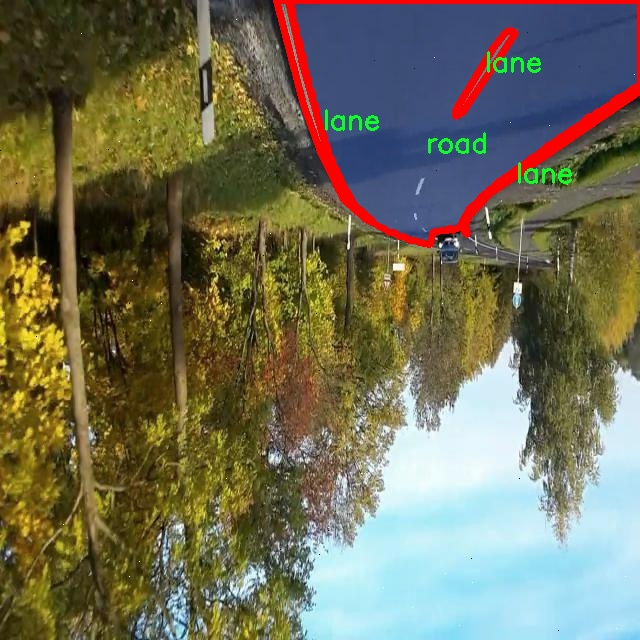
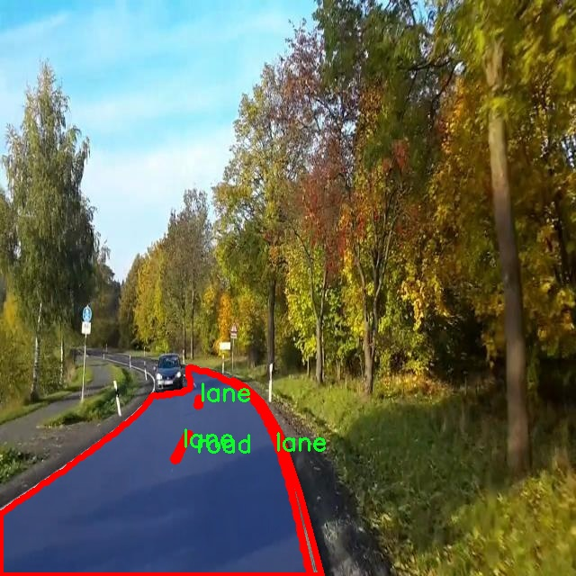
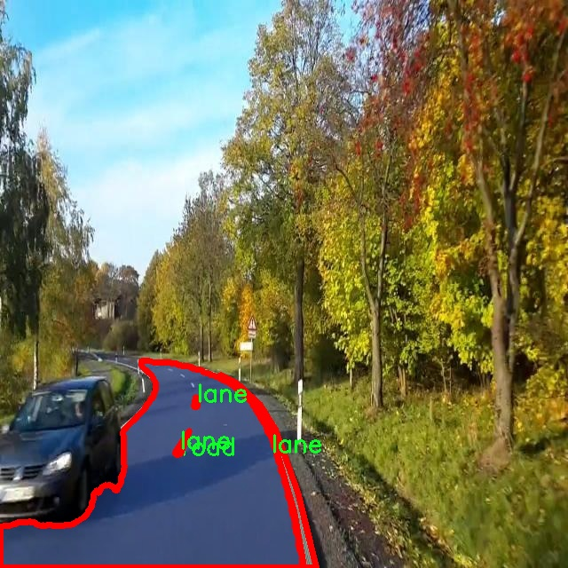
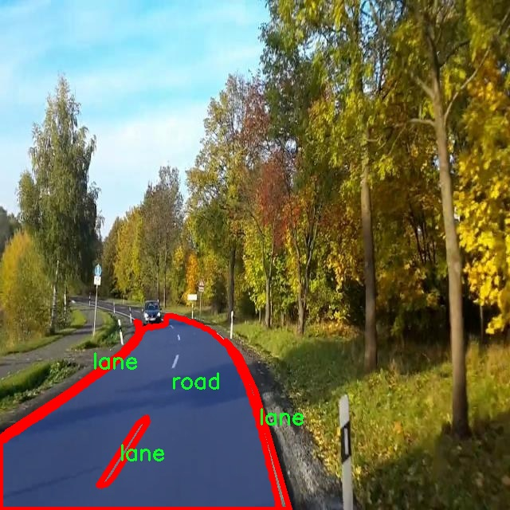
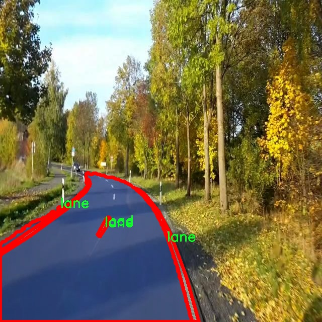

# 改进yolo11-fasternet等200+全套创新点大全：车道区域分割车道线检测系统源码＆数据集全套

### 1.图片效果展示







##### 项目来源 **[人工智能促进会 2024.10.28](https://kdocs.cn/l/cszuIiCKVNis)**

注意：由于项目一直在更新迭代，上面“1.图片效果展示”和“2.视频效果展示”展示的系统图片或者视频可能为老版本，新版本在老版本的基础上升级如下：（实际效果以升级的新版本为准）

  （1）适配了YOLOV11的“目标检测”模型和“实例分割”模型，通过加载相应的权重（.pt）文件即可自适应加载模型。

  （2）支持“图片识别”、“视频识别”、“摄像头实时识别”三种识别模式。

  （3）支持“图片识别”、“视频识别”、“摄像头实时识别”三种识别结果保存导出，解决手动导出（容易卡顿出现爆内存）存在的问题，识别完自动保存结果并导出到tempDir中。

  （4）支持Web前端系统中的标题、背景图等自定义修改。

  另外本项目提供训练的数据集和训练教程,暂不提供权重文件（best.pt）,需要您按照教程进行训练后实现图片演示和Web前端界面演示的效果。

### 2.视频效果展示

[2.1 视频效果展示](https://www.bilibili.com/video/BV1NLSsYCEJp/)

### 3.背景

研究背景与意义

随着城市化进程的加快，交通拥堵和交通事故频发已成为全球范围内亟待解决的问题。车道线检测作为自动驾驶和智能交通系统中的关键技术之一，能够有效提高车辆行驶的安全性和效率。传统的车道线检测方法多依赖于手工特征提取和简单的图像处理技术，然而，这些方法在复杂环境下的鲁棒性和准确性往往不足。因此，基于深度学习的车道线检测技术逐渐受到研究者的关注。

YOLO（You Only Look Once）系列模型因其高效的实时目标检测能力而广泛应用于各类视觉任务。YOLOv11作为该系列的最新版本，结合了更为先进的网络结构和训练策略，具备了更强的特征提取能力和更快的推理速度。然而，现有的YOLOv11模型在车道区域分割和车道线检测任务中的应用仍有待进一步优化。为此，本研究旨在基于改进的YOLOv11模型，开发一套高效的车道区域分割与车道线检测系统。

本项目所使用的数据集包含751张图像，专注于车道（lane）和道路（road）这两个类别。通过对这些图像进行实例分割，我们可以精确识别和分离车道线与道路背景，从而为后续的车道线检测提供更加可靠的基础。改进YOLOv11模型的关键在于优化其特征提取模块，以提高对复杂场景中车道线的检测精度。此外，利用实例分割技术，可以在保持高效性的同时，提升对车道区域的理解能力。

综上所述，本研究不仅具有重要的理论意义，也为智能交通系统的实际应用提供了可行的解决方案。通过提升车道线检测的准确性和实时性，能够有效减少交通事故的发生，改善交通流量，为构建安全、高效的智能交通环境奠定基础。

### 4.数据集信息展示

##### 4.1 本项目数据集详细数据（类别数＆类别名）

nc: 2
names: ['lane', 'road']


该项目为【图像分割】数据集，请在【训练教程和Web端加载模型教程（第三步）】这一步的时候按照【图像分割】部分的教程来训练

##### 4.2 本项目数据集信息介绍

本项目数据集信息介绍

本项目所使用的数据集名为“final2”，旨在为改进YOLOv11的车道区域分割及车道线检测系统提供高质量的训练数据。该数据集包含两类主要目标，分别为“lane”（车道线）和“road”（道路），总类别数量为2。这一精简的类别设置使得模型在训练过程中能够更加专注于车道线与道路的分割与识别，从而提高检测的准确性和效率。

“final2”数据集经过精心构建，涵盖了多种复杂的道路场景，包含城市街道、高速公路、乡村道路等多种环境，以确保模型在不同情况下的泛化能力。数据集中包含的图像经过标注，确保每一条车道线和道路区域都被准确识别，提供了丰富的样本供模型学习。这些图像不仅包括晴天的清晰视角，还涵盖了雨天、夜间等不同光照和天气条件下的场景，进一步增强了数据集的多样性。

在数据集的构建过程中，特别注重了标注的准确性和一致性，确保每个图像中的车道线和道路区域都经过严格审核。这种高质量的标注为YOLOv11模型的训练提供了坚实的基础，使其能够在实际应用中实现更高的检测精度。此外，数据集的规模也经过合理设计，以平衡训练时间和模型性能，使得训练过程既高效又不失准确性。

通过使用“final2”数据集，本项目旨在推动车道线检测技术的发展，提升自动驾驶系统的安全性和可靠性，为未来的智能交通系统奠定基础。











### 5.全套项目环境部署视频教程（零基础手把手教学）

[5.1 所需软件PyCharm和Anaconda安装教程（第一步）](https://www.bilibili.com/video/BV1BoC1YCEKi/?spm_id_from=333.999.0.0&vd_source=bc9aec86d164b67a7004b996143742dc)


[5.2 安装Python虚拟环境创建和依赖库安装视频教程（第二步）](https://www.bilibili.com/video/BV1ZoC1YCEBw?spm_id_from=333.788.videopod.sections&vd_source=bc9aec86d164b67a7004b996143742dc)

### 6.改进YOLOv11训练教程和Web_UI前端加载模型教程（零基础手把手教学）

[6.1 改进YOLOv11训练教程和Web_UI前端加载模型教程（第三步）](https://www.bilibili.com/video/BV1BoC1YCEhR?spm_id_from=333.788.videopod.sections&vd_source=bc9aec86d164b67a7004b996143742dc)


按照上面的训练视频教程链接加载项目提供的数据集，运行train.py即可开始训练



     Epoch   gpu_mem       box       obj       cls    labels  img_size
     1/200     20.8G   0.01576   0.01955  0.007536        22      1280: 100%|██████████| 849/849 [14:42<00:00,  1.04s/it]
               Class     Images     Labels          P          R     mAP@.5 mAP@.5:.95: 100%|██████████| 213/213 [01:14<00:00,  2.87it/s]
                 all       3395      17314      0.994      0.957      0.0957      0.0843

     Epoch   gpu_mem       box       obj       cls    labels  img_size
     2/200     20.8G   0.01578   0.01923  0.007006        22      1280: 100%|██████████| 849/849 [14:44<00:00,  1.04s/it]
               Class     Images     Labels          P          R     mAP@.5 mAP@.5:.95: 100%|██████████| 213/213 [01:12<00:00,  2.95it/s]
                 all       3395      17314      0.996      0.956      0.0957      0.0845

     Epoch   gpu_mem       box       obj       cls    labels  img_size
     3/200     20.8G   0.01561    0.0191  0.006895        27      1280: 100%|██████████| 849/849 [10:56<00:00,  1.29it/s]
               Class     Images     Labels          P          R     mAP@.5 mAP@.5:.95: 100%|███████   | 187/213 [00:52<00:00,  4.04it/s]
                 all       3395      17314      0.996      0.957      0.0957      0.0845


###### [项目数据集下载链接](https://kdocs.cn/l/cszuIiCKVNis)

### 7.原始YOLOv11算法讲解

YOLOv11是一种由Ultralytics公司开发的最新一代目标检测模型，以其增强的特征提取能力和更高的效率在计算机视觉领域引人注目。该模型在架构上进行了关键升级，通过更新主干和颈部结构，显著提高了对复杂视觉场景的理解和处理精度。YOLOv11不仅在目标检测上表现出色，还支持实例分割、图像分类、姿态估计和定向目标检测（OBB）等任务，展示出其多功能性。

与其前身YOLOv8相比，YOLOv11在设计上实现了深度和宽度的改变，同时引入了几个创新机制。其中，C3k2机制是对YOLOv8中的C2f的改进，提升了浅层特征的处理能力；C2PSA机制则进一步优化了特征图的处理流程。解耦头的创新设计，通过增加两个深度卷积（DWConv），提高了模型对细节的感知能力和分类准确性。

在性能上，YOLOv11m模型在COCO数据集上的平均精度（mAP）提高，并减少了22%的参数量，确保了在运算效率上的突破。该模型可以部署在多种平台上，包括边缘设备、云平台以及支持NVIDIA GPU的系统，彰显出卓越的灵活性和适应性。总体而言，YOLOv11通过一系列的创新突破，对目标检测领域产生了深远的影响，并为未来的开发提供了新的研究方向。


****文档**** ： _ _https://docs.ultralytics.com/models/yolo11/__

****代码链接**** ： _ _https://github.com/ultralytics/ultralytics__

******Performance Metrics******


​ ** **关键特性****

****◆**** ** **增强的特征提取能力**** ：YOLO11采用了改进的主干和颈部架构，增强了 ** **特征提取****
能力，能够实现更精确的目标检测和复杂任务的执行。

****◆**** ** **优化的效率和速度****
：YOLO11引入了精细化的架构设计和优化的训练流程，提供更快的处理速度，并在准确性和性能之间保持最佳平衡。

****◆**** ** **参数更少、精度更高****
：通过模型设计的改进，YOLO11m在COCO数据集上实现了更高的平均精度（mAP），同时使用的参数比YOLOv8m少22%，使其在计算上更加高效，而不牺牲准确性。

****◆**** ** **跨环境的适应性**** ：YOLO11可以无缝部署在各种环境中，包括边缘设备、云平台和支持NVIDIA
GPU的系统，确保最大的灵活性。

****◆**** ** **支持广泛任务****
：无论是目标检测、实例分割、图像分类、姿态估计还是定向目标检测（OBB），YOLO11都旨在应对一系列计算机视觉挑战。

****支持的任务和模式****


​YOLO11建立在YOLOv8中引入的多功能模型范围之上，为各种计算机视觉任务提供增强的支持:


​该表提供了YOLO11模型变体的概述，展示了它们在特定任务中的适用性以及与Inference、Validation、Training和Export等操作模式的兼容性。从实时检测到复杂的分割任务
，这种灵活性使YOLO11适用于计算机视觉的广泛应用。

##### yolov11的创新

■ yolov8 VS yolov11

YOLOv5，YOLOv8和YOLOv11均是ultralytics公司的作品，ultralytics出品必属精品。


​ **具体创新点** ：

**① 深度（depth）和宽度 （width）**

YOLOv8和YOLOv11是基本上完全不同。

**② C3k2机制**

C3k2有参数为c3k，其中在网络的浅层c3k设置为False。C3k2就相当于YOLOv8中的C2f。


​ **③ C2PSA机制**

下图为C2PSA机制的原理图。


​ **④ 解耦头**

解耦头中的分类检测头增加了两个 **DWConv** 。


▲Conv

    
    
    def autopad(k, p=None, d=1):  # kernel, padding, dilation
    
        """Pad to 'same' shape outputs."""
    
        if d > 1:
    
            k = d * (k - 1) + 1 if isinstance(k, int) else [d * (x - 1) + 1 for x in k]  # actual kernel-size
    
        if p is None:
    
            p = k // 2 if isinstance(k, int) else [x // 2 for x in k]  # auto-pad
    
    return p
    
    
    class Conv(nn.Module):
    
        """Standard convolution with args(ch_in, ch_out, kernel, stride, padding, groups, dilation, activation)."""
    
    
        default_act = nn.SiLU()  # default activation
    
    
        def __init__(self, c1, c2, k=1, s=1, p=None, g=1, d=1, act=True):
    
            """Initialize Conv layer with given arguments including activation."""
    
            super().__init__()
    
            self.conv = nn.Conv2d(c1, c2, k, s, autopad(k, p, d), groups=g, dilation=d, bias=False)
    
            self.bn = nn.BatchNorm2d(c2)
    
            self.act = self.default_act if act is True else act if isinstance(act, nn.Module) else nn.Identity()
    
    
        def forward(self, x):
    
            """Apply convolution, batch normalization and activation to input tensor."""
    
            return self.act(self.bn(self.conv(x)))
    
    
        def forward_fuse(self, x):
    
            """Perform transposed convolution of 2D data."""
    
            return self.act(self.conv(x))

▲Conv2d

    
    
    torch.nn.Conv2d(in_channels, out_channels, kernel_size, stride=1, padding=0, dilation=1, groups=1, bias=True, padding_mode='zeros')

▲DWConv

DWConv ** **代表 Depthwise Convolution（深度卷积）****
，是一种在卷积神经网络中常用的高效卷积操作。它主要用于减少计算复杂度和参数量。

    
    
    class DWConv(Conv):
    
        """Depth-wise convolution."""
    
    
        def __init__(self, c1, c2, k=1, s=1, d=1, act=True):  # ch_in, ch_out, kernel, stride, dilation, activation
    
            """Initialize Depth-wise convolution with given parameters."""
    
            super().__init__(c1, c2, k, s, g=math.gcd(c1, c2), d=d, act=act)


### 8.200+种全套改进YOLOV11创新点原理讲解

#### 8.1 200+种全套改进YOLOV11创新点原理讲解大全

由于篇幅限制，每个创新点的具体原理讲解就不全部展开，具体见下列网址中的改进模块对应项目的技术原理博客网址【Blog】（创新点均为模块化搭建，原理适配YOLOv5~YOLOv11等各种版本）

[改进模块技术原理博客【Blog】网址链接](https://gitee.com/qunmasj/good)


#### 8.2 精选部分改进YOLOV11创新点原理讲解

###### 这里节选部分改进创新点展开原理讲解(完整的改进原理见上图和[改进模块技术原理博客链接](https://gitee.com/qunmasj/good)【如果此小节的图加载失败可以通过CSDN或者Github搜索该博客的标题访问原始博客，原始博客图片显示正常】
### 全维动态卷积ODConv
鉴于上述讨论，我们的ODConv引入了一种多维注意机制，该机制具有并行策略，用于学习卷积核在核空间的所有四个维度上的不同注意。图提供了CondConv、DyConv和ODConv的示意性比较。

ODConv的公式：根据等式1中的符号，ODConv可定义为


 将注意力标量分配给整个卷积核。图2示出了将这四种类型的关注乘以n个卷积核的过程。原则上，这四种类型的关注是相互补充的，并且以位置、信道、滤波器和核的顺序将它们逐步乘以卷积核 
 ，使得卷积运算不同w.r.t.所有空间位置、所有输入信道、所有滤波器和输入x的所有核，提供捕获丰富上下文线索的性能保证。因此，ODConv可以显著增强CNN基本卷积运算的特征提取能力。此外，具有单个卷积核的ODConv可以与标准CondConv和DyConv竞争或优于它们，为最终模型引入的额外参数大大减少。提供了大量实验来验证这些优点。通过比较等式1和等式2，我们可以清楚地看到，ODConv是一种更广义的动态卷积。此外，当设置n=1且 所有分量均为1时，只关注滤波器方向 的ODConv将减少为：将基于输入特征的SE变量应用于卷积滤波器，然后进行卷积运算（注意原始SE（Hu等人，2018b）基于输出特征，并且用于重新校准输出特征本身）。这种SE变体是ODConv的特例。


图：将ODConv中的四种注意类型逐步乘以卷积核的示例。（a） 沿空间维度的逐位置乘法运算，（b）沿输入信道维度的逐信道乘法运算、（c）沿输出信道维度的按滤波器乘法运算，以及（d）沿卷积核空间的核维度的按核乘法运算。方法部分对符号进行了说明
实现：对于ODConv，一个关键问题是如何计算卷积核的四种关注度 。继CondConv和DyConv之后，我们还使用SE型注意力模块（Hu等人，2018b），但将多个头部作为来计算它们，其结构如图所示。具体而言，首先通过逐通道全局平均池（GAP）运算将输入压缩到具有长度的特征向量中。随后，存在完全连接（FC）层和四个头部分支。ReLU（Krizhevsky等人，2012）位于FC层之后。FC层将压缩特征向量映射到具有缩减比的低维空间（根据消融实验，我们在所有主要实验中设置 ，避免了高模型复杂度）。对于四个头部分支，每个分支都有一个输出大小如图。

### 引入ODConv的改进YOLO
参考这篇博客涵盖了引入ODConv的改进YOLOv11系统的内容，ODConv采用多维注意机制，在卷积核空间的四个维度上学习不同的注意。结合了CondConv和DyConv的优势，ODConv通过图示的四种注意类型逐步与卷积核相乘，以捕获丰富的上下文线索，提升特征提取能力。

#### ODConv结构与方法
ODConv的公式和图示展示了其关注力分配给卷积核的方式，其中四种类型的关注以位置、信道、滤波器和核的顺序逐步与卷积核相乘。这种结构保证了卷积运算不同于标准的Conv操作，能够捕获更多上下文信息，从而增强了CNN的特征提取能力。另外，单个卷积核的ODConv在性能上能够与CondConv和DyConv相竞争，并且引入的额外参数大幅减少。

ODConv的特殊之处在于其广义的动态卷积性质，同时在特定条件下（n=1且所有分量为1），它可以退化为一种特例，即只关注滤波器方向，这类似于基于输入特征的SE变体，但不同于原始SE，它基于输出特征。

#### ODConv的实现
关键问题在于如何计算卷积核的四种关注度。ODConv采用了SE型注意力模块，结合了多个头部来计算这些关注度。具体实现上，通过逐通道全局平均池运算和完全连接层，将输入压缩为特征向量，随后使用四个头部分支来计算四种不同类型的关注。这样的结构能在保持模型复杂度可控的情况下，提升了特征的表征能力。

ODConv的引入为YOLOv11带来了显著的性能提升，并且通过大量实验证明了其在特征提取方面的优越性。其结合了多维注意机制和卷积操作，为目标检测和分拣系统的提升带来了新的思路和性能突破。


### 9.系统功能展示

图9.1.系统支持检测结果表格显示

  图9.2.系统支持置信度和IOU阈值手动调节

  图9.3.系统支持自定义加载权重文件best.pt(需要你通过步骤5中训练获得)

  图9.4.系统支持摄像头实时识别

  图9.5.系统支持图片识别

  图9.6.系统支持视频识别

  图9.7.系统支持识别结果文件自动保存

  图9.8.系统支持Excel导出检测结果数据


### 10. YOLOv11核心改进源码讲解

#### 10.1 rep_block.py

以下是对给定代码的核心部分进行分析和详细注释的结果。我们将保留与 `DiverseBranchBlock` 相关的主要功能和结构，同时添加详细的中文注释。

```python
import torch
import torch.nn as nn
import torch.nn.functional as F

# 定义DiverseBranchBlock模块
class DiverseBranchBlock(nn.Module):
    def __init__(self, in_channels, out_channels, kernel_size,
                 stride=1, padding=None, dilation=1, groups=1,
                 internal_channels_1x1_3x3=None,
                 deploy=False, single_init=False):
        super(DiverseBranchBlock, self).__init__()
        self.deploy = deploy  # 是否为部署模式

        self.kernel_size = kernel_size  # 卷积核大小
        self.in_channels = in_channels  # 输入通道数
        self.out_channels = out_channels  # 输出通道数
        self.groups = groups  # 分组卷积的组数
        
        # 自动计算填充
        if padding is None:
            padding = (kernel_size // 2)  # 对于卷积核大小为奇数时，padding为kernel_size的一半
        assert padding == kernel_size // 2  # 确保padding是正确的

        # 部署模式下直接使用卷积层
        if deploy:
            self.dbb_reparam = nn.Conv2d(in_channels=in_channels, out_channels=out_channels, kernel_size=kernel_size,
                                          stride=stride, padding=padding, dilation=dilation, groups=groups, bias=True)
        else:
            # 非部署模式下构建多个分支
            self.dbb_origin = self.conv_bn(in_channels, out_channels, kernel_size, stride, padding, dilation, groups)

            # 平均池化分支
            self.dbb_avg = nn.Sequential()
            if groups < out_channels:
                self.dbb_avg.add_module('conv',
                                        nn.Conv2d(in_channels=in_channels, out_channels=out_channels, kernel_size=1,
                                                  stride=1, padding=0, groups=groups, bias=False))
                self.dbb_avg.add_module('bn', nn.BatchNorm2d(out_channels))
                self.dbb_avg.add_module('avg', nn.AvgPool2d(kernel_size=kernel_size, stride=stride, padding=0))
                self.dbb_1x1 = self.conv_bn(in_channels, out_channels, kernel_size=1, stride=stride,
                                            padding=0, groups=groups)
            else:
                self.dbb_avg.add_module('avg', nn.AvgPool2d(kernel_size=kernel_size, stride=stride, padding=padding))
            self.dbb_avg.add_module('avgbn', nn.BatchNorm2d(out_channels))

            # 1x1卷积和kxk卷积分支
            if internal_channels_1x1_3x3 is None:
                internal_channels_1x1_3x3 = in_channels if groups < out_channels else 2 * in_channels
            self.dbb_1x1_kxk = nn.Sequential()
            self.dbb_1x1_kxk.add_module('conv1', nn.Conv2d(in_channels=in_channels, out_channels=internal_channels_1x1_3x3,
                                                            kernel_size=1, stride=1, padding=0, groups=groups, bias=False))
            self.dbb_1x1_kxk.add_module('bn1', nn.BatchNorm2d(internal_channels_1x1_3x3))
            self.dbb_1x1_kxk.add_module('conv2', nn.Conv2d(in_channels=internal_channels_1x1_3x3, out_channels=out_channels,
                                                            kernel_size=kernel_size, stride=stride, padding=0, groups=groups, bias=False))
            self.dbb_1x1_kxk.add_module('bn2', nn.BatchNorm2d(out_channels))

        # 初始化参数
        if single_init:
            self.single_init()

    def conv_bn(self, in_channels, out_channels, kernel_size, stride=1, padding=0, dilation=1, groups=1):
        """构建卷积层和批归一化层的组合"""
        conv_layer = nn.Conv2d(in_channels=in_channels, out_channels=out_channels, kernel_size=kernel_size,
                                stride=stride, padding=padding, dilation=dilation, groups=groups, bias=False)
        bn_layer = nn.BatchNorm2d(num_features=out_channels, affine=True)
        return nn.Sequential(conv_layer, bn_layer)

    def forward(self, inputs):
        """前向传播"""
        if hasattr(self, 'dbb_reparam'):
            return self.dbb_reparam(inputs)  # 如果在部署模式下，直接使用重参数化的卷积层

        # 否则使用原始分支进行计算
        out = self.dbb_origin(inputs)  # 原始卷积分支
        if hasattr(self, 'dbb_1x1'):
            out += self.dbb_1x1(inputs)  # 1x1卷积分支
        out += self.dbb_avg(inputs)  # 平均池化分支
        out += self.dbb_1x1_kxk(inputs)  # kxk卷积分支
        return out  # 返回最终的输出

    def single_init(self):
        """单一初始化方法"""
        self.init_gamma(0.0)  # 将gamma初始化为0
        if hasattr(self, "dbb_origin"):
            nn.init.constant_(self.dbb_origin[0].weight, 1.0)  # 将原始卷积的权重初始化为1

    def init_gamma(self, gamma_value):
        """初始化gamma值"""
        if hasattr(self, "dbb_origin"):
            nn.init.constant_(self.dbb_origin[1].weight, gamma_value)  # 初始化批归一化的权重
        if hasattr(self, "dbb_1x1"):
            nn.init.constant_(self.dbb_1x1[1].weight, gamma_value)
        if hasattr(self, "dbb_avg"):
            nn.init.constant_(self.dbb_avg[1].weight, gamma_value)
        if hasattr(self, "dbb_1x1_kxk"):
            nn.init.constant_(self.dbb_1x1_kxk[1].weight, gamma_value)
```

### 代码分析
1. **DiverseBranchBlock 类**: 该类是一个神经网络模块，主要用于构建具有多种卷积分支的网络结构。
2. **构造函数**: 在构造函数中，模块根据输入参数初始化卷积层、批归一化层和其他分支。
3. **前向传播**: 在 `forward` 方法中，模块计算输入的输出，通过不同的分支组合最终的结果。
4. **参数初始化**: 提供了单一初始化和 gamma 值初始化的方法，以便于模型训练时的稳定性。

### 总结
以上代码展示了一个复杂的卷积神经网络模块的实现，具有多种分支结构，适用于不同的任务。通过合理的参数初始化和模块组合，可以有效提高模型的性能。

这个文件 `rep_block.py` 定义了一些用于构建神经网络中多样化分支块的类和函数，主要使用 PyTorch 框架。文件中包含多个类和函数，它们的主要目的是实现不同类型的卷积操作和相应的批归一化（Batch Normalization），以提高网络的表现。

首先，文件导入了必要的库，包括 PyTorch 的核心库和一些自定义模块。接着，定义了一些用于卷积和批归一化的转换函数。这些函数的作用包括将卷积核和批归一化的参数融合、添加分支卷积、处理不同大小的卷积核等。这些转换函数为后续的卷积块提供了灵活的操作方式。

接下来，定义了几个主要的类：

1. **IdentityBasedConv1x1**：这个类实现了一个基于身份映射的 1x1 卷积层。它通过将卷积核初始化为单位矩阵的形式来保留输入特征，同时允许通过卷积操作进行学习。这个类的 `forward` 方法实现了前向传播，并且提供了获取实际卷积核的功能。

2. **BNAndPadLayer**：这个类结合了批归一化和填充操作。它在前向传播时先进行批归一化，然后根据需要进行填充，确保输出的特征图在空间维度上保持一致。

3. **DiverseBranchBlock**：这是一个多样化分支块的实现，包含多个卷积分支。它的构造函数允许用户定义输入输出通道、卷积核大小、步幅、填充等参数。该类在前向传播时会将多个分支的输出相加，并通过非线性激活函数进行处理。

4. **DiverseBranchBlockNOAct**：这个类与 `DiverseBranchBlock` 类似，但不包含非线性激活函数。它的设计使得在某些情况下可以更灵活地使用。

5. **DeepDiverseBranchBlock** 和 **WideDiverseBranchBlock**：这两个类扩展了 `DiverseBranchBlock` 的功能，分别实现了更深和更宽的分支结构，适用于不同的网络架构需求。它们都支持部署模式，并在前向传播中结合了多个卷积分支的输出。

这些类和函数的设计旨在提供灵活性和可扩展性，使得用户可以根据具体的任务需求构建复杂的卷积神经网络结构。整体来看，文件中的实现充分利用了 PyTorch 的模块化特性，允许用户方便地组合和修改不同的卷积块，以达到更好的性能。

#### 10.2 mamba_yolo.py

以下是代码中最核心的部分，并附上详细的中文注释：

```python
import torch
import torch.nn as nn
from einops import rearrange

class LayerNorm2d(nn.Module):
    """二维层归一化"""
    def __init__(self, normalized_shape, eps=1e-6, elementwise_affine=True):
        super().__init__()
        self.norm = nn.LayerNorm(normalized_shape, eps, elementwise_affine)

    def forward(self, x):
        # 将输入张量从 (B, C, H, W) 转换为 (B, H, W, C)
        x = rearrange(x, 'b c h w -> b h w c').contiguous()
        # 进行层归一化
        x = self.norm(x)
        # 将张量转换回 (B, C, H, W)
        x = rearrange(x, 'b h w c -> b c h w').contiguous()
        return x

class CrossScan(torch.autograd.Function):
    """交叉扫描操作"""
    @staticmethod
    def forward(ctx, x: torch.Tensor):
        B, C, H, W = x.shape
        ctx.shape = (B, C, H, W)
        xs = x.new_empty((B, 4, C, H * W))
        # 将输入张量展平并存储不同的变换
        xs[:, 0] = x.flatten(2, 3)  # 原始顺序
        xs[:, 1] = x.transpose(dim0=2, dim1=3).flatten(2, 3)  # 转置后的顺序
        xs[:, 2:4] = torch.flip(xs[:, 0:2], dims=[-1])  # 反转顺序
        return xs

    @staticmethod
    def backward(ctx, ys: torch.Tensor):
        B, C, H, W = ctx.shape
        L = H * W
        # 反向传播时合并不同的梯度
        ys = ys[:, 0:2] + ys[:, 2:4].flip(dims=[-1]).view(B, 2, -1, L)
        y = ys[:, 0] + ys[:, 1].view(B, -1, W, H).transpose(dim0=2, dim1=3).contiguous().view(B, -1, L)
        return y.view(B, -1, H, W)

class SelectiveScanCore(torch.autograd.Function):
    """选择性扫描核心操作"""
    @staticmethod
    @torch.cuda.amp.custom_fwd
    def forward(ctx, u, delta, A, B, C, D=None, delta_bias=None, delta_softplus=False, nrows=1, backnrows=1):
        # 确保输入张量是连续的
        if u.stride(-1) != 1:
            u = u.contiguous()
        if delta.stride(-1) != 1:
            delta = delta.contiguous()
        if D is not None and D.stride(-1) != 1:
            D = D.contiguous()
        if B.stride(-1) != 1:
            B = B.contiguous()
        if C.stride(-1) != 1:
            C = C.contiguous()
        
        # 保存输入张量以备反向传播使用
        ctx.delta_softplus = delta_softplus
        ctx.backnrows = backnrows
        out, x, *rest = selective_scan_cuda_core.fwd(u, delta, A, B, C, D, delta_bias, delta_softplus, 1)
        ctx.save_for_backward(u, delta, A, B, C, D, delta_bias, x)
        return out

    @staticmethod
    @torch.cuda.amp.custom_bwd
    def backward(ctx, dout, *args):
        u, delta, A, B, C, D, delta_bias, x = ctx.saved_tensors
        if dout.stride(-1) != 1:
            dout = dout.contiguous()
        # 反向传播时计算梯度
        du, ddelta, dA, dB, dC, dD, ddelta_bias, *rest = selective_scan_cuda_core.bwd(
            u, delta, A, B, C, D, delta_bias, dout, x, ctx.delta_softplus, 1
        )
        return (du, ddelta, dA, dB, dC, dD, ddelta_bias, None, None, None, None)

def cross_selective_scan(x: torch.Tensor, x_proj_weight: torch.Tensor, dt_projs_weight: torch.Tensor, A_logs: torch.Tensor, Ds: torch.Tensor, out_norm: torch.nn.Module = None):
    """交叉选择性扫描操作"""
    B, D, H, W = x.shape
    L = H * W

    xs = CrossScan.apply(x)  # 进行交叉扫描
    x_dbl = torch.einsum("b k d l, k c d -> b k c l", xs, x_proj_weight)  # 计算投影
    dts, Bs, Cs = torch.split(x_dbl, [R, N, N], dim=2)  # 分割张量
    dts = torch.einsum("b k r l, k d r -> b k d l", dts, dt_projs_weight)  # 进一步计算

    # 进行选择性扫描
    ys: torch.Tensor = SelectiveScan.apply(xs, dts, A_logs, Bs, Cs, Ds, None, True).view(B, K, -1, H, W)
    y: torch.Tensor = CrossMerge.apply(ys)  # 合并结果

    # 进行输出归一化
    if out_norm is not None:
        y = out_norm(y.view(B, -1, H, W)).permute(0, 2, 3, 1)  # (B, H, W, C)

    return y

class SS2D(nn.Module):
    """SS2D模块"""
    def __init__(self, d_model=96, d_state=16, ssm_ratio=2.0, ssm_rank_ratio=2.0, act_layer=nn.SiLU, dropout=0.0):
        super().__init__()
        self.in_proj = nn.Conv2d(d_model, int(ssm_ratio * d_model), kernel_size=1, bias=False)
        self.out_proj = nn.Conv2d(int(ssm_ratio * d_model), d_model, kernel_size=1, bias=False)
        self.dropout = nn.Dropout(dropout) if dropout > 0. else nn.Identity()
        self.act = act_layer()

    def forward(self, x: torch.Tensor):
        x = self.in_proj(x)  # 输入投影
        x = self.act(x)  # 激活函数
        x = self.dropout(x)  # 应用dropout
        x = self.out_proj(x)  # 输出投影
        return x

class VSSBlock_YOLO(nn.Module):
    """VSSBlock模块"""
    def __init__(self, in_channels: int, hidden_dim: int, drop_path: float):
        super().__init__()
        self.proj_conv = nn.Conv2d(in_channels, hidden_dim, kernel_size=1, bias=True)
        self.ss2d = SS2D(d_model=hidden_dim)  # 使用SS2D模块
        self.drop_path = DropPath(drop_path)

    def forward(self, input: torch.Tensor):
        input = self.proj_conv(input)  # 投影
        x = self.ss2d(input)  # 通过SS2D模块
        x = input + self.drop_path(x)  # 残差连接
        return x
```

### 代码核心部分解释：
1. **LayerNorm2d**: 实现了二维层归一化，适用于图像数据的归一化处理。
2. **CrossScan**: 定义了交叉扫描操作，主要用于在前向传播中对输入张量进行不同变换并存储。
3. **SelectiveScanCore**: 实现了选择性扫描的前向和反向传播逻辑，核心功能是根据输入进行选择性计算。
4. **cross_selective_scan**: 组合了交叉扫描和选择性扫描的操作，完成输入的投影和输出的归一化。
5. **SS2D**: 该模块实现了输入的投影、激活和输出的处理，作为核心模块之一。
6. **VSSBlock_YOLO**: 这是一个完整的块，结合了投影、选择性扫描和残差连接，形成一个高效的特征提取单元。

这些核心部分构成了整个模型的基础，负责输入的处理、特征的提取和最终的输出。

这个程序文件 `mamba_yolo.py` 是一个用于构建深度学习模型的 PyTorch 实现，主要用于计算机视觉任务，特别是与 YOLO（You Only Look Once）相关的目标检测模型。文件中包含多个类和函数，主要实现了不同的神经网络模块和操作。

首先，文件导入了一些必要的库，包括 PyTorch、数学运算、函数式编程工具和类型注解。它还尝试导入一些 CUDA 相关的模块，用于加速计算。

文件中定义了一个 `LayerNorm2d` 类，它是对 2D 数据进行层归一化的实现。该类的 `forward` 方法将输入张量的维度进行调整，以适应 `nn.LayerNorm` 的要求。

接下来，定义了一个 `autopad` 函数，用于自动计算卷积操作的填充，以确保输出形状与输入形状相同。

文件中还实现了多个自定义的 PyTorch 操作，包括 `CrossScan` 和 `CrossMerge`，它们分别用于处理输入张量的交叉扫描和合并。这些操作在神经网络中用于处理特征图，以提高模型的表达能力。

`SelectiveScanCore` 类实现了选择性扫描的核心功能，这是一种特殊的操作，用于在深度学习模型中处理序列数据。该类的 `forward` 和 `backward` 方法分别实现了前向传播和反向传播的逻辑。

`cross_selective_scan` 函数是一个高层次的接口，用于执行选择性扫描操作，并提供了一些参数以控制其行为。它处理输入数据并通过多个线性变换和选择性扫描操作生成输出。

接下来，定义了 `SS2D` 类，这是一个基于选择性扫描的 2D 模块，包含多个参数和层，包括卷积层、线性层和激活函数。该模块的 `forward` 方法实现了数据的前向传播。

`RGBlock` 和 `LSBlock` 类分别实现了不同的块结构，包含卷积层、激活函数和跳跃连接，旨在提高特征提取的能力。

`XSSBlock` 和 `VSSBlock_YOLO` 类则是更复杂的模块，结合了选择性扫描和其他结构，形成了更深层次的网络组件。这些模块通常用于构建更大的网络架构，如 YOLO 模型。

`SimpleStem` 类实现了一个简单的网络前端，通常用于处理输入图像并提取初步特征。它包含两个卷积层和相应的归一化和激活层。

最后，`VisionClueMerge` 类实现了特征合并的功能，通常用于将不同层次的特征进行融合，以便于后续的处理。

整体来看，这个文件实现了一个复杂的深度学习模型结构，结合了多种现代神经网络技术，适用于计算机视觉任务，特别是目标检测。每个模块和操作都经过精心设计，以提高模型的性能和效率。

#### 10.3 mamba_vss.py

以下是代码中最核心的部分，并附上详细的中文注释：

```python
import torch
import torch.nn as nn
import torch.nn.functional as F

class SS2D(nn.Module):
    def __init__(self, d_model, d_state=16, d_conv=3, expand=2, dropout=0., bias=False):
        super().__init__()
        self.d_model = d_model  # 输入特征的维度
        self.d_state = d_state  # 状态的维度
        self.d_conv = d_conv  # 卷积核的大小
        self.expand = expand  # 扩展因子
        self.d_inner = int(self.expand * self.d_model)  # 内部特征维度

        # 输入投影层，将输入特征映射到更高维度
        self.in_proj = nn.Linear(self.d_model, self.d_inner * 2, bias=bias)

        # 卷积层，进行特征提取
        self.conv2d = nn.Conv2d(
            in_channels=self.d_inner,
            out_channels=self.d_inner,
            groups=self.d_inner,
            bias=bias,
            kernel_size=d_conv,
            padding=(d_conv - 1) // 2,
        )
        self.act = nn.SiLU()  # 激活函数

        # 输出层，最终将特征映射回原始维度
        self.out_proj = nn.Linear(self.d_inner, self.d_model, bias=bias)
        self.dropout = nn.Dropout(dropout) if dropout > 0. else None  # dropout层

    def forward(self, x: torch.Tensor):
        # 前向传播函数
        B, H, W, C = x.shape  # 获取输入的形状
        xz = self.in_proj(x)  # 输入投影
        x, z = xz.chunk(2, dim=-1)  # 将投影结果分为两个部分

        x = x.permute(0, 3, 1, 2).contiguous()  # 调整维度以适应卷积层
        x = self.act(self.conv2d(x))  # 经过卷积和激活函数
        y = self.forward_core(x)  # 经过核心计算
        y = y * F.silu(z)  # 使用z进行加权
        out = self.out_proj(y)  # 输出投影
        if self.dropout is not None:
            out = self.dropout(out)  # 应用dropout
        return out

    def forward_core(self, x: torch.Tensor):
        # 核心计算逻辑
        B, C, H, W = x.shape
        L = H * W  # 计算总的空间维度

        # 进行特征处理和状态更新的计算
        # 这里省略了具体的实现细节，假设有复杂的状态更新逻辑

        return y  # 返回处理后的特征

class VSSBlock(nn.Module):
    def __init__(self, hidden_dim: int = 0, drop_path: float = 0.2):
        super().__init__()
        self.ln_1 = nn.LayerNorm(hidden_dim)  # 归一化层
        self.self_attention = SS2D(d_model=hidden_dim)  # 自注意力机制
        self.drop_path = nn.Dropout(drop_path)  # DropPath层

    def forward(self, input: torch.Tensor):
        input = input.permute((0, 2, 3, 1))  # 调整输入维度
        x = input + self.drop_path(self.self_attention(self.ln_1(input)))  # 残差连接
        return x.permute((0, 3, 1, 2))  # 调整输出维度

# 示例代码
if __name__ == '__main__':
    inputs = torch.randn((1, 64, 32, 32)).cuda()  # 随机输入
    model = VSSBlock(64).cuda()  # 创建模型
    pred = model(inputs)  # 前向传播
    print(pred.size())  # 输出结果的形状
```

### 代码说明：
1. **SS2D类**：实现了一个自注意力机制的模块，包含输入投影、卷积层和输出投影。核心计算逻辑在`forward_core`方法中实现。
2. **VSSBlock类**：使用`SS2D`作为自注意力机制，并结合了LayerNorm和DropPath进行处理，形成一个完整的块结构。
3. **前向传播**：在`forward`方法中，输入经过投影、卷积、注意力计算和输出投影，最终返回处理后的特征。

该代码实现了一个复杂的自注意力机制模块，适用于深度学习模型中的特征提取和状态更新。

这个程序文件 `mamba_vss.py` 定义了几个深度学习模块，主要包括 `SS2D`、`VSSBlock` 和 `Mamba2Block`。这些模块主要用于构建具有自注意力机制的神经网络，特别是在处理时序数据或图像数据时。以下是对代码的详细说明。

首先，文件导入了一些必要的库，包括 PyTorch 及其神经网络模块、数学库、Einops（用于张量重排）、以及一些自定义的模块和函数。文件的开头部分尝试导入一些可能存在的外部模块，如果导入失败则不抛出错误。

`SS2D` 类是一个核心模块，主要实现了一个带有自注意力机制的神经网络单元。它的构造函数接受多个参数，包括模型的维度、状态维度、卷积核大小、扩展因子等。该类内部定义了多个线性层和卷积层，用于处理输入数据。`dt_init`、`A_log_init` 和 `D_init` 是一些静态方法，用于初始化模型的参数。

在 `forward_corev0` 方法中，输入数据经过一系列的张量操作和变换，最终通过选择性扫描函数进行处理。这一过程涉及到多个张量的分割、重组和线性变换，目的是提取特征并进行状态更新。最后，输出经过层归一化处理后返回。

`VSSBlock` 类是一个更高层次的模块，它在 `SS2D` 的基础上添加了层归一化和残差连接。它的构造函数初始化了归一化层和自注意力层，并实现了前向传播方法，处理输入数据并返回经过处理的结果。

`Mamba2Block` 类是 `VSSBlock` 的一个子类，重写了自注意力层，使用了 `Mamba2Simple` 模块。它的前向传播方法与 `VSSBlock` 类似，但在处理输入时进行了不同的张量变换。

在文件的最后部分，有一个测试代码块，创建了随机输入数据，并实例化了 `VSSBlock` 和 `Mamba2Block` 模型，进行前向传播并打印输出的尺寸。这部分代码用于验证模型的构建和功能是否正常。

整体来看，这个文件实现了一个复杂的自注意力机制模块，适用于时序数据或图像数据的处理，具有良好的灵活性和可扩展性。

#### 10.4 val.py

以下是代码中最核心的部分，并附上详细的中文注释：

```python
class DetectionValidator(BaseValidator):
    """
    扩展自 BaseValidator 类的检测模型验证器。
    用于评估 YOLO 模型的性能。
    """

    def __init__(self, dataloader=None, save_dir=None, pbar=None, args=None, _callbacks=None):
        """初始化检测模型所需的变量和设置。"""
        super().__init__(dataloader, save_dir, pbar, args, _callbacks)
        self.metrics = DetMetrics(save_dir=self.save_dir, on_plot=self.on_plot)  # 初始化检测指标
        self.iouv = torch.linspace(0.5, 0.95, 10)  # 定义 mAP@0.5:0.95 的 IoU 向量
        self.niou = self.iouv.numel()  # IoU 的数量

    def preprocess(self, batch):
        """对 YOLO 训练的图像批次进行预处理。"""
        batch["img"] = batch["img"].to(self.device, non_blocking=True)  # 将图像转移到设备上
        batch["img"] = (batch["img"].half() if self.args.half else batch["img"].float()) / 255  # 归一化图像
        for k in ["batch_idx", "cls", "bboxes"]:
            batch[k] = batch[k].to(self.device)  # 将其他数据转移到设备上

        return batch  # 返回处理后的批次

    def postprocess(self, preds):
        """对预测输出应用非极大值抑制（NMS）。"""
        return ops.non_max_suppression(
            preds,
            self.args.conf,
            self.args.iou,
            multi_label=True,
            agnostic=self.args.single_cls,
            max_det=self.args.max_det,
        )  # 返回经过 NMS 处理的预测结果

    def update_metrics(self, preds, batch):
        """更新指标统计信息。"""
        for si, pred in enumerate(preds):
            self.seen += 1  # 更新已处理的样本数量
            npr = len(pred)  # 当前预测的数量
            pbatch = self._prepare_batch(si, batch)  # 准备当前批次的数据
            cls, bbox = pbatch.pop("cls"), pbatch.pop("bbox")  # 获取真实标签和边界框

            if npr == 0:  # 如果没有预测结果
                continue  # 跳过

            predn = self._prepare_pred(pred, pbatch)  # 准备预测结果
            # 评估预测结果
            stat["tp"] = self._process_batch(predn, bbox, cls)  # 计算真阳性
            for k in self.stats.keys():
                self.stats[k].append(stat[k])  # 更新统计信息

    def get_stats(self):
        """返回指标统计信息和结果字典。"""
        stats = {k: torch.cat(v, 0).cpu().numpy() for k, v in self.stats.items()}  # 转换为 numpy 数组
        if len(stats) and stats["tp"].any():
            self.metrics.process(**stats)  # 处理指标
        return self.metrics.results_dict  # 返回结果字典

    def print_results(self):
        """打印每个类别的训练/验证集指标。"""
        pf = "%22s" + "%11i" * 2 + "%11.3g" * len(self.metrics.keys)  # 打印格式
        LOGGER.info(pf % ("all", self.seen, self.nt_per_class.sum(), *self.metrics.mean_results()))  # 打印总结果

        # 打印每个类别的结果
        if self.args.verbose and not self.training and self.nc > 1 and len(self.stats):
            for i, c in enumerate(self.metrics.ap_class_index):
                LOGGER.info(pf % (self.names[c], self.seen, self.nt_per_class[c], *self.metrics.class_result(i)))  # 打印每个类别的详细结果
```

### 代码核心部分解释：
1. **DetectionValidator 类**：这是一个用于验证 YOLO 模型性能的类，继承自 `BaseValidator`。
2. **__init__ 方法**：初始化一些重要的变量和设置，包括检测指标和 IoU 向量。
3. **preprocess 方法**：对输入的图像批次进行预处理，包括设备转移和归一化。
4. **postprocess 方法**：应用非极大值抑制（NMS）来过滤掉冗余的预测框。
5. **update_metrics 方法**：更新模型的性能指标，计算真阳性等统计信息。
6. **get_stats 方法**：返回当前的统计信息和结果字典。
7. **print_results 方法**：打印训练和验证集的指标结果，包括每个类别的详细信息。

这些部分是 YOLO 模型验证的核心逻辑，负责处理数据、更新指标并输出结果。

这个程序文件 `val.py` 是一个用于目标检测模型验证的类，继承自 `BaseValidator`。它主要用于在训练过程中评估 YOLO（You Only Look Once）模型的性能，特别是在 COCO 数据集上的表现。程序的核心功能包括数据预处理、指标计算、结果输出等。

在初始化方法中，类会设置一些必要的变量和参数，例如验证数据加载器、保存目录、进度条、命令行参数等。它还会初始化一些指标，比如目标检测的 mAP（平均精度）和混淆矩阵。

`preprocess` 方法负责对输入的图像批次进行预处理，包括将图像转换为适合模型输入的格式，以及根据需要进行归一化处理。此方法还会为自动标注准备标签。

`init_metrics` 方法用于初始化评估指标，检查数据集是否为 COCO 格式，并设置相应的类映射和指标名称。

`postprocess` 方法应用非极大值抑制（NMS）来处理模型的预测输出，以减少重叠的边界框。

`_prepare_batch` 和 `_prepare_pred` 方法分别用于准备真实标签和模型预测的边界框，以便后续的评估。

`update_metrics` 方法负责更新当前批次的评估指标，包括计算真阳性、预测类别等。它还会根据需要将预测结果保存为 JSON 或 TXT 格式。

`finalize_metrics` 方法在所有批次处理完成后设置最终的指标值，包括计算速度和混淆矩阵。

`get_stats` 方法返回当前的评估统计数据，并计算每个类别的目标数量。

`print_results` 方法负责打印每个类别的评估结果，包括图像数量、实例数量和各类指标。

`_process_batch` 方法计算预测与真实标签之间的匹配情况，返回正确预测的矩阵。

`build_dataset` 和 `get_dataloader` 方法用于构建数据集和数据加载器，以便于后续的验证过程。

`plot_val_samples` 和 `plot_predictions` 方法用于可视化验证样本和模型预测结果，生成图像并保存。

`save_one_txt` 方法将 YOLO 检测结果保存为 TXT 文件，格式为归一化坐标。

`pred_to_json` 方法将预测结果序列化为 COCO JSON 格式，以便后续评估。

`eval_json` 方法用于评估 YOLO 输出的 JSON 格式结果，并返回性能统计数据，利用 pycocotools 计算 mAP。

整体来看，这个文件实现了一个完整的目标检测模型验证流程，涵盖了数据处理、指标计算、结果输出和可视化等多个方面，旨在帮助用户评估 YOLO 模型在特定数据集上的性能。

注意：由于此博客编辑较早，上面“10.YOLOv11核心改进源码讲解”中部分代码可能会优化升级，仅供参考学习，以“11.完整训练+Web前端界面+200+种全套创新点源码、数据集获取”的内容为准。

### 11.完整训练+Web前端界面+200+种全套创新点源码、数据集获取


# [下载链接：https://mbd.pub/o/bread/Zp6Xl5tu](https://mbd.pub/o/bread/Zp6Xl5tu)